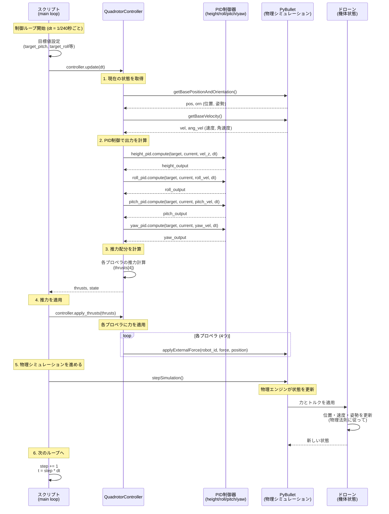
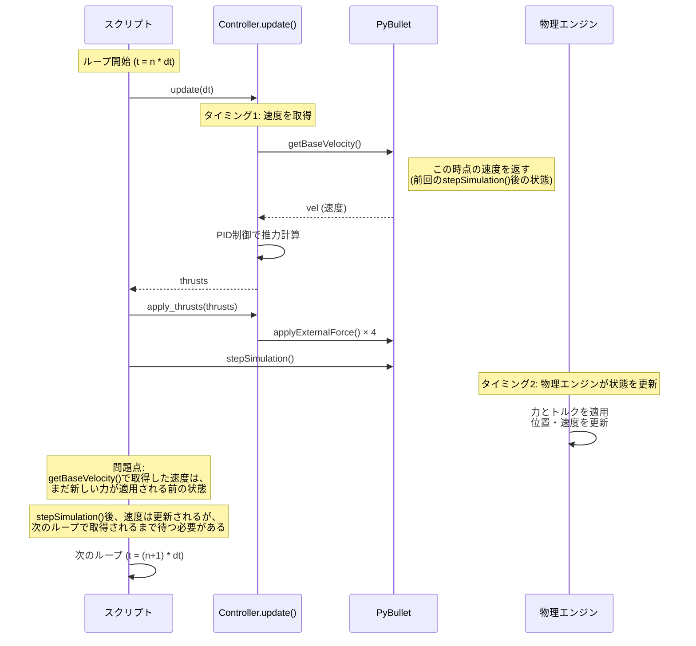
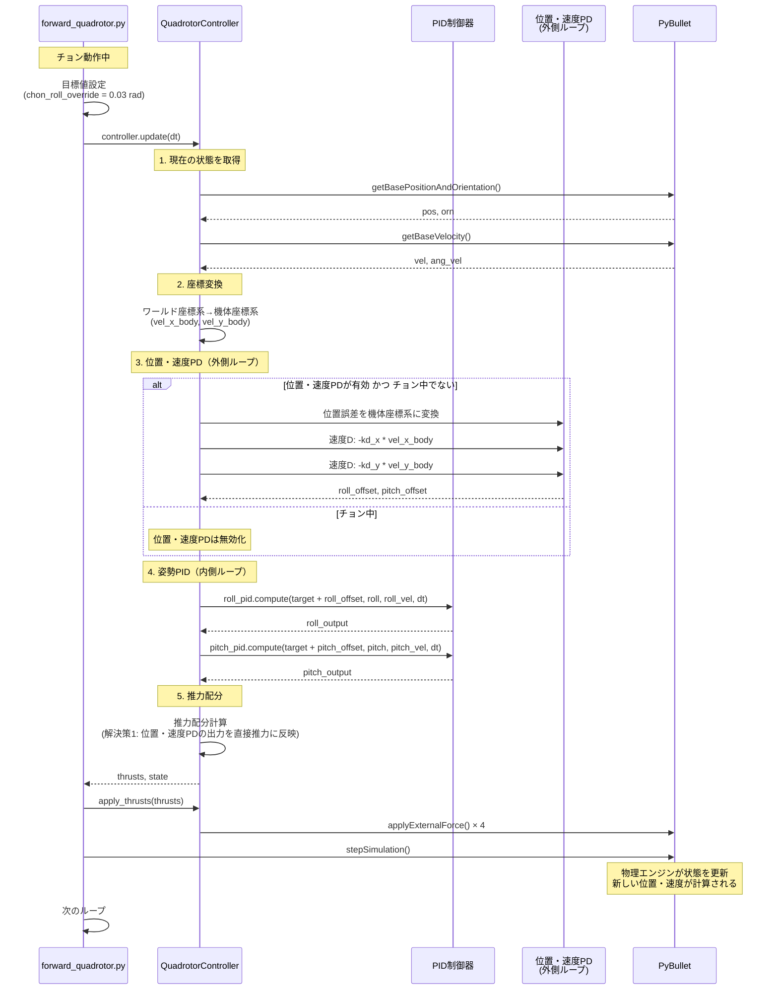
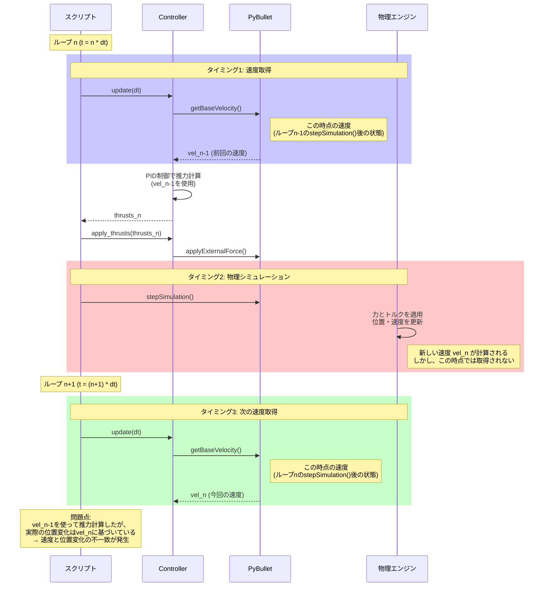

# Quadrotor制御フローのシーケンス図

スクリプトからドローンへの指示、PID制御、PyBulletシミュレーションの流れを可視化する。

---

## 基本制御ループのシーケンス図

---

## 速度取得タイミングの問題点

---

## 詳細な制御フロー（forward_quadrotor.pyの場合）

---

## 速度取得タイミングの問題の詳細

---

## 問題の原因

1. **速度取得のタイミング**
   - `getBaseVelocity()`は`stepSimulation()`の**前**に呼ばれる
   - 取得した速度は**前回の**`stepSimulation()`後の状態
   - しかし、位置変化は**今回の**`stepSimulation()`後の状態

2. **制御ループとのずれ**
   - PID制御は前回の速度に基づいて推力を計算
   - 物理エンジンは新しい力に基づいて状態を更新
   - 次のループで新しい速度を取得するまで、ずれが発生

3. **加速度が大きい時の問題**
   - 加速度が大きいと、速度の変化も大きい
   - タイミングのずれが速度の不一致として現れる
   - 特に方向（符号）が逆になることがある

---

## 参考

- `valcheck.py`: ホバリング状態での速度検証
- `forward_quadrotor.py`: チョン動作中の速度検証
- `valcheck_log.md`: 検証結果の記録
